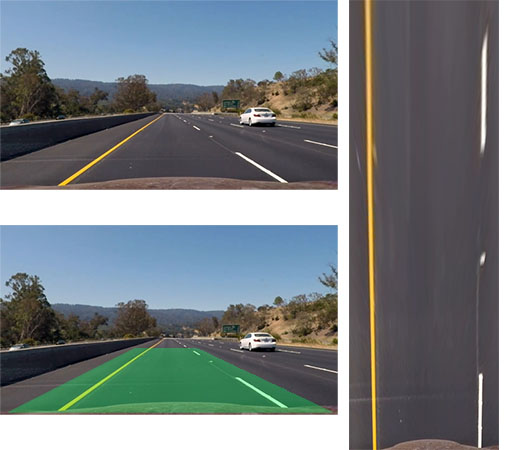
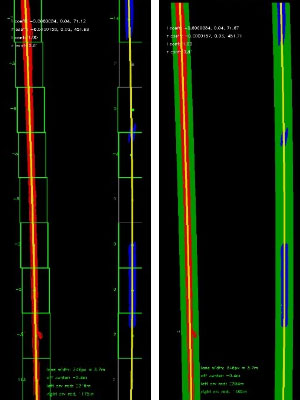
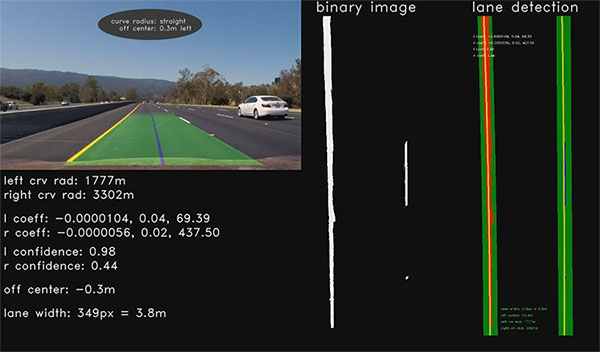
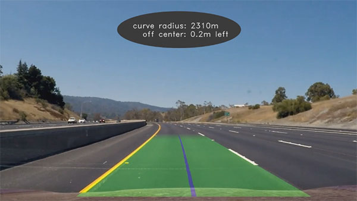

**Advanced Lane Finding Project**

---
###Project Files

I implemented the initial pipeline in a notebook (`Advanced_lane_lines.ipynb`). This was used to work on single test images and includes image undistortion. The distortion coefficients are pickled and reused in the video pipeline below.  

In order to process videos, I moved to regular python files. Included in the project are:  
- `advLaneDetect.py`
Main function. Includes undistortion, generation of binary images and video outputs.  
- `advLaneDetect_line.py`
Implements Line class   
- `advLaneDetectUtil.py`
Contains all other functions needed to run the lane detection   

You can process any video by running:  
```
python advLaneDetect.py videofile.mp4
```

---
###Camera Calibration

The code for this step is contained in the second code cell of the notebook located in `Advanced_lane_lines.ipynb`.  

I am extracting corners from the 9x6 calibration checkerboards via `cv2.findChessboardCorners()`. For each successful detection of all 54 corners, the resulting corners are appended to the `imgPoints` array. Likewise, the `objPoints` array is appended with a pre-set array of world space coordinates with z=0.  

The resulting `objpoints` and `imgpoints` are fed into `cv2.calibrateCamera()` to compute the distortion coefficients. It is then applied to the test images using `cv2.undistort()` with the following sample result:


###Pipeline
Except for the distortion correction, the pipeline in the notebook is entirely out-of-date. I will discuss my pipeline for a single image based on my final video pipeline in the .py files mentioned above.

####1. Distortion correction
The coefficients for the distortion correction are read in lines 271-272 of advLaneDetect.py. Each image is undistorted in line 45 within `process_image()`.

Example original / undistorted image:


####2. Perspective transform

The perspective transform is carried out in lines 50-68 of `advLaneDetect.py`. I am hardcoding my region of interest in the original undistorted image and arrived at the values iteratively by making the lane lines mostly parallel in the resulting image. I am simply projecting my `src` area to the entire size of a newly created image for the perspective transform. Note that the perspective transform image has very different dimensions than the original input image in order to represent the true width and length of the road ahead more appropriately.
```
src = np.float32(
        [[30, 700],
         [1250, 700],
         [748, 475],
         [532, 475]])
dst = np.float32(
        [[0, warpedImgSize[1]],
         [warpedImgSize[0], warpedImgSize[1]],
         [warpedImgSize[0], 0],
         [0, 0]])

```
Example undistorted / region of interest / perspective-transformed image


####3. Binary image creation

Binary image creation is handled in lines 83-158 of `advLaneDetect.py` (there is still a lot of optional stuff going on there which I left in the code in order to be able to get back to it for future extensions).

As opposed to the original "intent" of the project, I did feature detection on the perspective transformed images. Overall results were much more robust - in particular, they were much less noisy further down the road.

After using many combinations of single-channel and different Sobel thresholds which worked well in the project video, but very poorly in the challenge video, I ended up getting the most robust results out of a combination of color thresholds that are fed through a custom de-noising step.

I am using Contrast Limited Adaptive Histogram Equalization on the original image to extract the white lines, while using the untouched original image to extract yellow.  
Three different color binary images are created, each with different levels of sensitivity. They are all fed through a de-noising function and ultimately combined.

### 3.1. Binary image de-noising

The de-noising function is in lines 86-122 of `advLaneDetectUtil.py` in `denoiseBinary()`.

This is a part of the project that gave me the largest boost in performance across different road conditions, and also the part that could still use more work to make it more intelligent.  
Having three different color threshold images with different sensitivities means that one or two will be noisy to a point where they are detrimental to lane detection, while the others will contain valuable features. The high sensitivity threshold finds features in very dark images, medium sensitivity works well in low contrast images, while the low sensitivity threshold performs well in ideal road conditions.

We need to make sure that the good features are retained while noise is deleted. To that end, I am traversing each image in 50 pixel windows in the y-direction. Noise is defined as the number of columns within a window that contain a non-zero value. The assumption is that a clean detection of both lines comes with about 70 pixels in x. Accounting for curvature and in order to not be too aggressive, the threshold is set at 100. If the threshold is exceeded, all values in the window are replaced by zeroes. If more than 2/5th of an image are noisy, the entire image is discarded.

Finally, all three de-noised images are added to form the final binary image.

Example low/medium/high sensitivity and de-noised/combined binary image
![alt text][image3]

####4. Lane-line detection and polynomial fit

I used sliding-window fit for the initial detection of lanes, lines 154-238 in `advLaneDetectUtil.py` in `slidingWindowFit()`. To get a reasonable starting point, I am dividing the left and right halves of the binary image and look for histogram spikes - implemented in lines 131-148 of `advLaneDetectUtil.py` in `findLaneBases()`. From there, I simply traverse up the candidate line. The constraints I am currently putting on it are:
- at least 75 non-zero pixels (with 9 windows)
- remove spikes by ignoring windows that move too far off the prevailing direction
- a minimum amount of one third of windows need to contain the candidate line for it to be valid
The method returns a polynomial fit and a confidence measure. Confidence is defined by the amount of unique non-zero pixels along the y-axis.

Once a line has been detected, I search within a margin of the previous polynomial fit to detect the current frame's line. 

The result is fed to the left or right instance of the line class for further processing (via `updateData()` in `advLaneDetect_line.py`). I am performing one more sanity check for peaky lines in line 129 of `advLaneDetect_line` where I am limiting the change of the first and second polynomial coefficient, which can turn the confidence of the line to zero.
- if the confidence is above a threshold, simply accept it
- if it is below threshold, blend in a mix of the previous fit and a mirrored version of the opposing line's fit. The influence of the mirrored fit will grow depending on how small the confidence in the current line is compared to the confidence in the opposite line.

The current frame's best fit is then averaged over the past seven frames.



####5. Radius of curvature / Car position off-center

Both are entirely straight forward. Car position compared to center-of-lane is implemented in lines 324-335 of `advLaneDetectUtil.py` in `getCarPositionOffCenter()`. The curve radius for each line is computed in lines 301-322 of `advLaneDetectUtil.py` in `getCurveRadius()`



####6. Final image output

Final image output is implemented in lines 446-519 of `advLaneDetectUtil.py` in `makeFinalLaneImage()`. It plots the left and right line, fills a polygon, and does the inverse perspective projection to map it back onto the original image



---

###Final videos

1. Project Video
..* [Lane Detection](https://www.youtube.com/watch?v=QYuzTa9Fm3A)
..* [Full Data Overlay](https://www.youtube.com/watch?v=44u-XubOzSE)
2. Challenge Video
..* [Lane Detection](https://www.youtube.com/watch?v=ucL19iP7cYU)
..* [Full Data Overlay](https://www.youtube.com/watch?v=SGj0VkRjMxI)

---

###Discussion

I ended up spending a lot of my time on the binary images in order to get the best possible input data. I initally settled on a mix of different color and Sobel images to get a rock-solid solution in the project video (I was already using my de-noise function at that point). However, that approach completely failed in the challenge video. I went back to the data to analyze frame-by-frame (with many images written out per-frame for debugging) and ended up with my approach that only uses the color thresholds and aggressive de-noising. The rest of the code stayed mostly unchanged and ended up solving the challenge video fairly well.

Another interesting challenge in this project was keeping a low-confidence line intact by mirroring the opposing line. As is evident in the challenge video, the lane width can thin out quite a lot temporarily which needed to be accounted for instead of simply keeping it at around 3.7 meters. I am averaging the current lane width over the past 10 frames and keep each line updated on it.

A few areas that need further improvement:
- Running the harder challenge video, it is obvious that a much larger part of the image needs to be considered to successfully detect lanes with stronger curvature than a freeway.
- De-noising needs to be more intelligent, possibly based on presence of noise in surrounding frames. I still get fairly noisy frames, and while they don't affect the result of the project and challenge videos, but fails in the harder challenge video. With more video data, I might even completely reconsider my binary image creation again... but at least that is relatively "cheap".
- The line mirroring is VERY simple right now. It just projects it across the lane by the amount of its width in pixels. While this is very fast and seems fairly reliable, I might want to look into using derivatives/normals of the fit for an accurate projection.
- A few more sanity checks could be implemented that look at coefficient noise over time and affect line confidence
